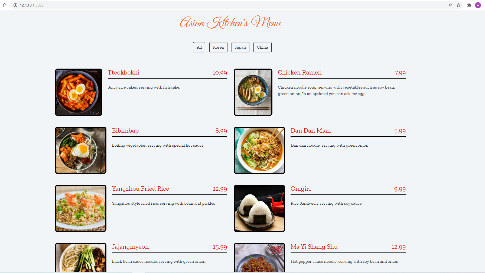
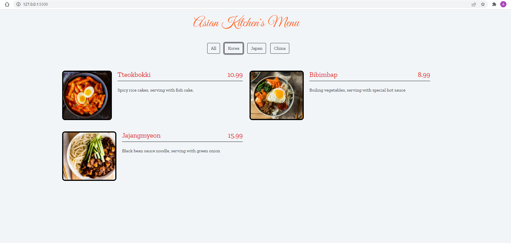
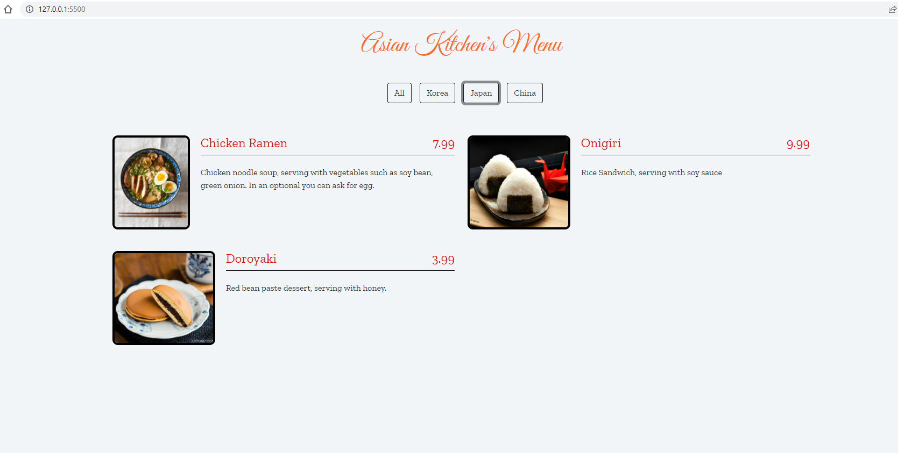
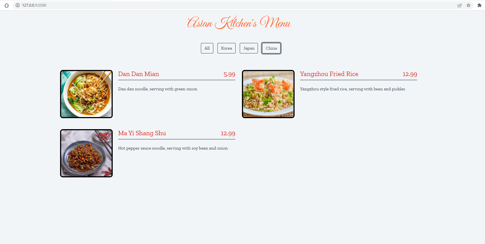

# Asian Kitchen's Menu

Bir uzak doğu restoran menüsü şeklinde düzenlenmiş sitede JavaScript sayesinde sayfalar arasında gezinilebilmektedir. Sizden istediğimiz JavaScript kısmını tamamlamanız. Siteyi detaylı incelemek için [Asian Kitchen's Menu](https://ayerdelen.github.io/AsianKitchen/)

- Sitedeki içerik JavaScript'te menu şeklinde bir dizi içinde objeler olarak tanımlanacak.
- Id, title, category, price, img ve desc bölümleri olacak.
- İçeriği istediğiniz gibi değiştirebilirsiniz yalnız değiştirirken kategori isimlerine ekstra dikkat edin.
- Butonlar da js dosyasından gelecek.
- Site içerisinde map, reduce gibi methodları kullanmanız gerekecek. 

- Örnek ekran görüntüleri => 
  - All Menü => 
    

  - Korean Menü => 
    

  - Japan Menü => 
    

  - Chinese Menü => 
    